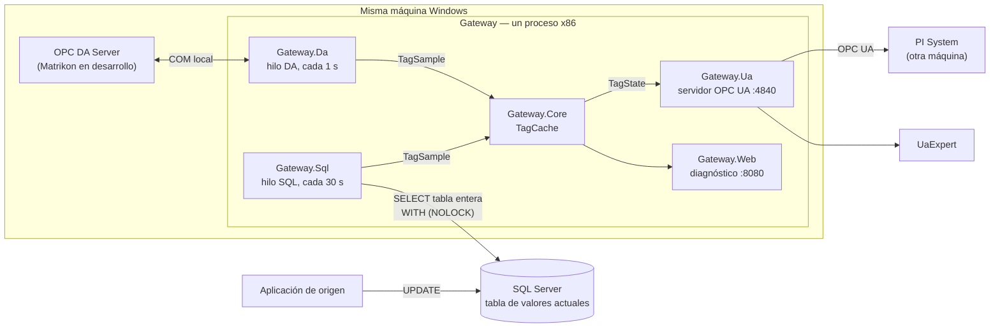

# Gateway OPC DA + SQL Server → OPC UA

Prueba de concepto, en un entorno de TEST, para alimentar un PI System: publica en
un mismo servidor OPC UA los tags de dos fuentes, un OPC DA Server legado y una
tabla de SQL Server que escribe otra aplicación, sin tocar ninguna de las dos.

**Repositorio:** https://github.com/AgustinRoffoPortfolio/opc-gateway-da-sql-ua

> **Alcance.** Es la versión 2 de
> [opc-gateway-da-ua](https://github.com/AgustinRoffoPortfolio/opc-gateway-da-ua),
> que solo tenía la fuente OPC DA. No es un producto y no va a producción: corre en
> TEST hasta que la integración definitiva llegue por otro servidor OPC UA (P12 de
> [`docs/v2/requisitos.md`](docs/v2/requisitos.md)).

## Demo

Corte de la base con las dos fuentes conviviendo (20 s, sin audio). Se apaga
SQL Server: los tags SQL pasan a `Uncertain` *last usable value* con el mismo
valor y `SourceTimestamp`, mientras los DA siguen en `Good` con la hora
corriendo. Al volver la base, el driver se reconecta solo y los SQL vuelven a
`Good`. Se reproduce embebido solo desde github.com:

https://github.com/user-attachments/assets/69e591fb-9e74-496e-a296-98ca58c18286

El video de la v1 (solo la fuente DA, 500 tags, 35 s, sin audio) sigue
disponible; se reproduce embebido solo desde github.com:

https://github.com/user-attachments/assets/51d1219a-d208-4936-a5ff-b2411cad9c60

## Arquitectura



Cada fuente tiene su driver en su propio proyecto y su propio hilo. Los dos
escriben en la misma cache, y el servidor OPC UA solo lee de ella: no sabe de qué
fuente sale cada tag. La base puede estar en la misma máquina (en desarrollo, un
contenedor) o en otra; el servidor DA tiene que estar en la misma, porque no se
usa DCOM remoto.

El diseño de corrido está en [`docs/arquitectura.md`](docs/arquitectura.md).

## Cómo se levanta

**Requisitos:** Windows, .NET 10 SDK, los runtimes de .NET 10 **x86**
(`dotnet-runtime-win-x86` y `aspnetcore-runtime-win-x86`), Docker Desktop y
MatrikonOPC Server for Simulation and Testing.

1. **Simulador DA.** En el configurador de Matrikon, `File → Open` sobre
   `config/demo-10.opcsim.xml` (10 aliases).
2. **Base.** Copiar `.env.example` a `.env`, poner la password de `sa`, y levantar
   el contenedor. El esquema se carga una sola vez:

   ```powershell
   docker compose up -d
   docker cp .\tools\SqlSimulator\schema\01-create-current-values.sql gateway-sql:/tmp/
   docker exec -it gateway-sql /opt/mssql-tools18/bin/sqlcmd -S localhost -U sa -C -i /tmp/01-create-current-values.sql
   ```

3. **Credenciales del gateway.** Copiar
   `src/Gateway.Host/appsettings.Local.example.json` a `appsettings.Local.json` en
   la misma carpeta y completar `Sql:User` y `Sql:Password`. Ese archivo no se
   versiona.
4. **Simulador SQL**, en una ventana propia (la receta completa está en
   [`docs/v2/simulador.md`](docs/v2/simulador.md)):

   ```powershell
   $pw = Read-Host "Password de sa" -AsSecureString
   $env:SQLSIM_CONNSTR = "Server=127.0.0.1,1433;Database=PLANT_DB;User ID=sa;Password=$([System.Net.NetworkCredential]::new('', $pw).Password);Encrypt=True;TrustServerCertificate=True;Connect Timeout=5"
   dotnet run --project tools\SqlSimulator
   ```

5. **Gateway**, en otra ventana:

   ```powershell
   $env:Ua__TagsCsvPath = (Resolve-Path .\config\demo-mixto.tags.csv).Path
   dotnet run --project src/Gateway.Host
   ```

**Qué tiene que decir el log al arrancar:**

```text
Tags cargados: 21 validos, 0 con error, 0 con aviso
Address space listo: 21 tags
Driver DA conectado a Matrikon.OPC.Simulation.1, leyendo cada 1000 ms
Driver SQL conectado a 127.0.0.1:1433, consultando cada 30 s
WRN 1 tag(s) declarados con origen SQL que la consulta no trajo: PRUEBA_TAG_QUE_NO_EXISTE ...
WRN Filas anomalas en tags declarados del ciclo SQL: 2 tag(s): PRUEBA_NULO_CALIDAD ..., PRUEBA_NULO_VALOR ...
```

Más un WRN por `TrustServerCertificate` en `true`, esperado contra la base local.
Los tres WRN son a propósito: `demo-mixto` trae un tag ausente y dos con `NULL`
para que se vean esos casos. En la página de diagnóstico tienen que quedar los 10
tags DA en `Good` y los 11 SQL repartidos en 7 `Good`, 3 `Uncertain` y 1 `Bad`.

**Si el log dice `Tags cargados: 10 validos` y "No hay tags SOURCE=SQL", la
variable no se tomó.** `Ua:TagsCsvPath` tiene valor por defecto
(`config/tags.example.csv`, en `appsettings.json` y en `UaOptions.cs`), que trae
10 tags solo DA. Sin la variable el gateway no falla: arranca callado con ese CSV.
El README de la v1 decía que era "el único parámetro sin valor por defecto", y no
era cierto ni en la v1.

**Qué queda levantado:**

- **Servidor OPC UA** en `opc.tcp://127.0.0.1:4840/GatewayDaUa`, solo loopback,
  con Sign & Encrypt. La primera conexión se rechaza y es lo esperado: hay que
  confiar el certificado de los dos lados (en UaExpert, *Trust Server
  Certificate*; en el gateway, mover el del cliente de `pki/rejected/certs/` a
  `pki/trusted/certs/`). Conectarse por `127.0.0.1` y no por `localhost`.
- **Página de diagnóstico** en `http://localhost:8080`, con una tarjeta por
  fuente (estado del vínculo, caídas, contadores) y la tabla de tags.

Procedimiento completo, empaquetado y ruido conocido en los logs:
[`docs/operacion.md`](docs/operacion.md). Para la POC con PI System en otra
máquina: [`docs/LEEME-POC.txt`](docs/LEEME-POC.txt).

## Decisiones de diseño

Las decisiones de la v2 se citan como **V2-n** y están en
[`docs/v2/decisiones.md`](docs/v2/decisiones.md); las de la v1, por número, en
[`docs/decisiones.md`](docs/decisiones.md).

- **El tipo de dato compartido aguantó la segunda fuente.** El driver entrega
  `TagSample` (lo que acaba de leer) y el servidor UA pide `TagState` (el último
  estado conocido); son dos tipos y no una interfaz común (decisión 7). Al sumar
  SQL, ninguno de los dos cambió. Lo que no aguantó fue lo que la cache suponía sin
  decirlo por tener una sola fuente: un umbral único de antigüedad (V2-11) y un
  espacio único de nombres de origen (V2-12). Las dos eran correctas con un solo
  driver.
- **Ningún tipo de SqlClient sale del driver.** `Microsoft.Data.SqlClient` solo lo
  referencia `Gateway.Sql`; el host referencia el proyecto, no el paquete. Lo
  impone el grafo de referencias, no la disciplina: escribir `SqlConnection` fuera
  del driver no compila (V2-8). Fuera de `Gateway.Sql` el único uso está en un test
  que relee la cadena de conexión.
- **Una consulta sin `WHERE` y con `NOLOCK`.** Es el requisito R3: se trae la tabla
  entera y el filtrado a los tags del CSV lo hace la cache, para no mandarle al
  servidor una cláusula de miles de términos; `NOLOCK` evita bloquear a la
  aplicación que escribe. **El costo:** con `NOLOCK` SQL Server puede devolver un
  valor todavía no confirmado, o saltear o repetir una fila si la recorre mientras
  se escribe. Una fila repetida no rompe nada (la última pisa); una salteada deja
  ese tag en `Bad` por "fila ausente" durante un ciclo, hasta la próxima consulta.
  Es posible, pero no se observó ni se midió.
- **`TS` se convierte de hora local a UTC** (V2-18). La aplicación de origen
  escribe hora local y el `SourceTimestamp` de OPC UA es UTC por definición; sin
  convertir, los tags SQL quedarían corridos tres horas respecto de los DA. La zona
  es un parámetro (`Sql:TimeZone`, vacío = la de la máquina) y la conversión es
  explícita contra esa zona, nunca `ToUniversalTime()` sobre un `datetime` sin zona.
- **La calidad de un tag SQL sale de `Q` y nada más** (V2-11, V2-19, V2-23). `Q`
  usa los códigos de OPC DA y se decodifica con el mismo mapeo. A los tags SQL no se
  les aplica la degradación por antigüedad de la v1: cuando la aplicación de origen
  pierde el campo, marca `Q` y sigue refrescando `TS`, así que un tag caído puede
  tener el timestamp más nuevo de la tabla. Un umbral de antigüedad no lo
  detectaría y además degradaría tags sanos que esperan su grupo de scan.
- **Con la base caída, no mentirle al cliente** (V2-32). Si el driver pierde la
  base, los tags SQL en `Good` pasan a `Uncertain` *last usable value*, con el
  mismo valor y el mismo `SourceTimestamp`. `Bad` borraría el valor; `Good` diría
  que el dato está vivo cuando nadie lo refresca. La detección depende de en qué
  momento del ciclo cae el corte: el techo es ~40 s (polling 30 + timeout 10) y lo
  medido fue de ~12 a ~32 s. La recuperación, con la máquina libre, ~15–16 s
  ([`docs/v2/verificacion.md`](docs/v2/verificacion.md)).
- **Una fuente no frena ni pisa a la otra** (invariante 8: V2-10, V2-12). Cada
  fuente tiene su hilo, así que una consulta SQL colgada no demora la lectura DA; y
  la cache indexa por (fuente, tag de origen), así que un tag DA y una fila SQL con
  el mismo nombre no se pisan. Medido: en la Fase 5 la base estuvo caída unos tres
  minutos y medio, con 8 reintentos fallidos, y los tags DA siguieron en `Good` con
  `SourceTimestamp` avanzando; en la remedición del 02/10, los 10 tags DA estuvieron
  en `Good` en cada sondeo de 1 s durante los dos cortes.
- **Endpoint UA abierto a la red, solo para esta POC** (V2-28). PI System corre en
  otra máquina y el default de la v1 era loopback. Se abre por configuración local
  (`appsettings.Local.json`), no en el JSON versionado, y se mantienen solo
  lectura, Sign & Encrypt y confianza explícita de certificados. **El costo:** rompe
  a propósito el principio de "solo loopback" de la v1, y el certificado queda
  atado al nombre con el que se emitió (ver limitaciones).

## Qué encontró la v2 sobre la v1

Antes de escribir código se verificó la línea base de la v1 contra el código y no
contra su README. Salieron tres cosas:

- **Los tests no compilaban en el tag `v1.0.0`.** `GatewaySnapshot.Build` había
  sumado un parámetro y `GatewaySnapshotTests` no se actualizó. Arreglado con una
  línea en `04ced42`. Reproducible: `dotnet build` sobre el tag da `CS7036` en
  `GatewaySnapshotTests.cs(27,25)`.
- **Eran 59 tests, no 54.** El README de la v1 decía 54; con el arreglo corren 59
  en verde (los 5 de más son los del bug de `FILETIME`).
- **`TagsCsvPath` sí tenía valor por defecto**, en el JSON y en el código, contra
  lo que decía el README (ver "Cómo se levanta").

## Estado

Fuente SQL implementada y verificada. Hoy: **196 tests**, 191 correctos y 5 de
integración contra SQL Server que se omiten sin credenciales de prueba; con
`GATEWAY_SQL_TEST_USER` y `GATEWAY_SQL_TEST_PASSWORD` y el contenedor arriba,
196 de 196. Las mediciones de la v2 están en
[`docs/v2/verificacion.md`](docs/v2/verificacion.md); las de la v1 (carga, soak,
latencias) en [`docs/verificacion.md`](docs/verificacion.md) y no se repitieron
para la v2.

## Limitaciones y deuda declarada

- **El certificado lleva un solo nombre.** El SDK arma el SAN con el host de la URL
  vigente al emitirlo: si después cambia la URL, el cliente rechaza la conexión
  (`BadCertificateHostNameInvalid`) hasta borrar `pki/own` y rearrancar. Hoy se
  mitiga solo con el orden de pasos de `LEEME-POC.txt` (V2-28).
- **`faultLogged` no se reinicia al reconectar**, ni en DA ni en SQL: la bandera
  solo vuelve a `false` al cancelar. Desde la segunda caída el log dice "Sigue
  caido" en vez de "Se corto". Solo afecta el texto del log; la marca de V2-32 se
  aplica igual porque no depende de la bandera.
- **La aplicación de origen muerta con la base viva no se detecta** (P14). Si deja
  de escribir, las filas quedan con `Q` bueno y valores congelados, y el gateway
  los publica en `Good`: no distingue "nadie escribe" de "el valor no cambió".
  Medido una vez, como no cubierto (V2-32).
- **Una fila con `TS` nulo o un tipo inesperado aborta el ciclo SQL entero**
  (V2-33). El esquema real no lo permite, pero si pasara, todos los tags SQL
  quedarían en `Uncertain` con el log repitiendo "Sigue caido" aunque la base esté
  sana.
- **Un tag sin dato le llega al cliente con la hora actual como `SourceTimestamp`.**
  El gateway deja el nodo sin hora, pero el stack UA la reemplaza por `UtcNow`, en
  Read y en suscripción. Se distingue por el `StatusCode`, no por el timestamp
  ([V2-36](docs/v2/decisiones.md#v2-36--dos-comportamientos-del-stack-sobre-timestamps-no-se-corrigen)).
- **En un Read, el `ServerTimestamp` sale igual al `SourceTimestamp`.** Lo iguala el
  stack UA. El `ServerTimestamp` real solo se ve en suscripción
  ([V2-36](docs/v2/decisiones.md#v2-36--dos-comportamientos-del-stack-sobre-timestamps-no-se-corrigen)).
- **La password de SQL vive en un archivo local ignorado por git**
  (`appsettings.Local.json`, V2-26). Es la solución aceptada para la POC (P12); el
  guardado seguro definitivo queda fuera de alcance.
- **Heredado de la v1:** la lectura DA es sincrónica y sin timeout (el estado
  `Stalled` reporta el cuelgue pero no lo cura); los objetos COM se liberan por el
  finalizador y no de forma explícita; la tabla de diagnóstico muestra el
  `StatusCode` UA y no la calidad nominal; un tipo mal declarado en el CSV no se
  distingue de un valor imposible; el rechazo por token de usuario no se probó; no
  hay servicio de Windows ni usuarios y roles.

## Documentación

| Documento | Qué contiene |
|---|---|
| [`docs/arquitectura.md`](docs/arquitectura.md) | El diseño de corrido, con las dos fuentes |
| [`docs/glosario.md`](docs/glosario.md) | La jerga de OPC y de SQL Server |
| [`docs/operacion.md`](docs/operacion.md) | Cómo se levanta, se empaqueta y qué mirar si falla |
| [`docs/configuracion-tags.md`](docs/configuracion-tags.md) | El CSV campo por campo y la carga parcial |
| [`docs/calidad-da-ua.md`](docs/calidad-da-ua.md) | El mapeo de calidad DA ↔ StatusCode UA |
| **v2 — fuente SQL** | |
| [`docs/v2/requisitos.md`](docs/v2/requisitos.md) | Qué se pidió: R1–R7 y los puntos aclarados |
| [`docs/v2/decisiones.md`](docs/v2/decisiones.md) | Las 36 decisiones de la v2 con su porqué |
| [`docs/v2/verificacion.md`](docs/v2/verificacion.md) | Lo medido sobre la v2 |
| [`docs/v2/driver-sql.md`](docs/v2/driver-sql.md) | Evidencia de lo que se probó del driver SQL, paso a paso |
| [`docs/v2/simulador.md`](docs/v2/simulador.md) | El simulador de la tabla y cómo se levanta |
| [`docs/v2/calidad-observada.md`](docs/v2/calidad-observada.md) | Las calidades relevadas en la tabla real |
| **v1 — fuente DA** | |
| [`docs/decisiones.md`](docs/decisiones.md) | Las 30 decisiones de la v1 |
| [`docs/verificacion.md`](docs/verificacion.md) | Lo comprobado en la v1, fase por fase |
| [`docs/pruebas-carga.md`](docs/pruebas-carga.md) | Escala, memoria y soak (v1) |
| [`docs/pruebas-carga-rendimiento.md`](docs/pruebas-carga-rendimiento.md) | Varios clientes y latencias (v1) |
| [`docs/pruebas-carga-como-correr.md`](docs/pruebas-carga-como-correr.md) | Cómo se corre un escenario de carga |
| [`docs/bug-filetime-sdk.md`](docs/bug-filetime-sdk.md) | El bug de `FILETIME` del SDK DA |
| **Paquete para TEST** | |
| [`docs/LEEME-POC.txt`](docs/LEEME-POC.txt) | Instructivo de la POC con PI System |
| [`docs/LEEME-paquete.txt`](docs/LEEME-paquete.txt) | Instructivo del paquete distribuible de la v1 (solo DA) |
| [`docs/evidencia/`](docs/evidencia/) | Datos crudos de la prueba de timestamps (v1) |

## Repos hermanos

- **[opc-gateway-da-ua](https://github.com/AgustinRoffoPortfolio/opc-gateway-da-ua)**
  — la v1 de este gateway, solo con la fuente OPC DA.
- **[oilfield-scada](https://github.com/AgustinRoffoPortfolio/oilfield-scada)** —
  la cadena moderna completa, de campo a pantalla: RTU Modbus TCP → servidor OPC UA
  → TimescaleDB → dashboard con alarmas. C# / .NET 10.
- **[monitor-pozos](https://github.com/AgustinRoffoPortfolio/monitor-pozos)** —
  monitoreo de pozos en tiempo real con detección de anomalías. Python / FastAPI /
  PostgreSQL / React.

## Licencia

MIT. La v1 la heredó del SDK cliente OPC DA (`TitaniumAS.Opc.Client.NetCore`,
MIT; decisión 29). El stack OPC UA de la OPC Foundation también es MIT.

La v2 sumó una sola dependencia directa, `Microsoft.Data.SqlClient` 7.0.2, que es
MIT, y no cambia la licencia del repositorio. De las 22 dependencias transitivas
que restaura hoy, 21 son MIT; la excepción es `Microsoft.Data.SqlClient.SNI.runtime`, la
parte nativa que se carga en x86, que va bajo los términos de licencia de software
de Microsoft para código redistribuible. Ese binario no está en el repositorio
(llega por NuGet) y sus términos no son de tipo copyleft, así que el código de
este repositorio sigue siendo MIT. Lo que sí impone es una condición a quien
redistribuya el paquete compilado: se puede distribuir como parte de una
aplicación, no suelto.
