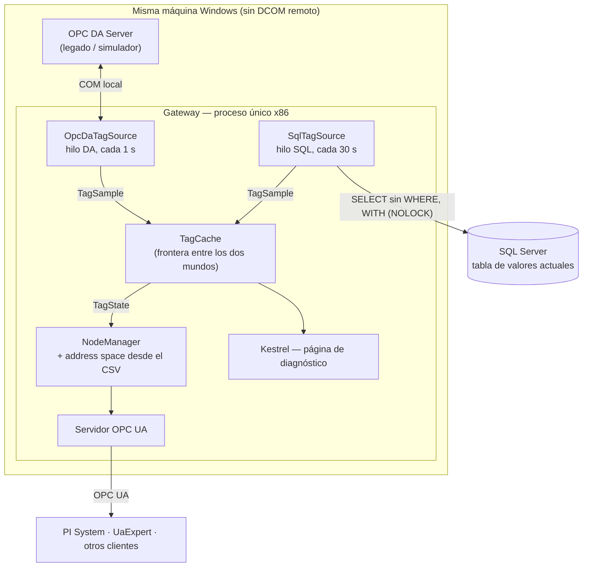

# Arquitectura

## Qué es

Un gateway que publica en un mismo servidor OPC UA los tags de dos fuentes: un
OPC DA Server legado y una tabla de SQL Server que escribe otra aplicación. Actúa
como **servidor OPC UA** hacia los clientes, y como **cliente OPC DA** y **cliente
SQL** hacia los orígenes. En el medio hay una cache propia, un mapeo de nombres
configurable por CSV, conversión de unidades, y traducción explícita de calidad y
timestamp.

Es una PoC en un entorno de TEST, para alimentar un PI System. No es un producto y
no va a producción. La v1 tenía solo la fuente DA; la v2 sumó la fuente SQL.

## Cómo está organizada la documentación

Este archivo cuenta el diseño de corrido: qué hace el gateway, cómo está armado
y por qué las piezas están donde están. Lo que se consulta de forma puntual vive
aparte:

| Documento | Qué contiene |
|---|---|
| [decisiones.md](decisiones.md) | Las decisiones de diseño de la v1, numeradas, con su porqué |
| [v2/decisiones.md](v2/decisiones.md) | Las decisiones de la v2 (V2-1 a V2-33), sobre la fuente SQL |
| [v2/requisitos.md](v2/requisitos.md) | Qué se pidió para la fuente SQL: R1–R7 y los puntos aclarados |
| [configuracion-tags.md](configuracion-tags.md) | El CSV campo por campo y la política de carga parcial |
| [calidad-da-ua.md](calidad-da-ua.md) | La tabla de mapeo de calidad DA a StatusCode UA |
| [v2/calidad-observada.md](v2/calidad-observada.md) | Qué códigos de calidad aparecen de verdad en la tabla SQL |
| [verificacion.md](verificacion.md) | Qué se comprobó con los propios ojos en la v1, fase por fase |
| [v2/verificacion.md](v2/verificacion.md) | Lo medido sobre la v2: caídas de la base, aislamiento, recuperación |
| [v2/driver-sql.md](v2/driver-sql.md) | Evidencia de lo que se probó del driver SQL, paso a paso |
| [v2/simulador.md](v2/simulador.md) | El simulador de la tabla SQL y cómo se levanta |
| [pruebas-carga.md](pruebas-carga.md) | Escala, memoria y soak: las corridas 1, 2 y 5 (v1) |
| [pruebas-carga-rendimiento.md](pruebas-carga-rendimiento.md) | Múltiples clientes y latencias: las corridas 3 y 4 (v1) |
| [pruebas-carga-como-correr.md](pruebas-carga-como-correr.md) | Cómo se arma y se corre un escenario de carga |
| [operacion.md](operacion.md) | Cómo se levanta, se empaqueta y qué mirar si falla |
| [bug-filetime-sdk.md](bug-filetime-sdk.md) | El bug de conversión de `FILETIME` del SDK cliente DA, su corrección y la evidencia |
| [glosario.md](glosario.md) | La jerga del dominio, de OPC y de SQL Server |
| [LEEME-POC.txt](LEEME-POC.txt) | Instructivo de la POC con PI System en otra máquina |
| [LEEME-paquete.txt](LEEME-paquete.txt) | Instructivo del paquete distribuible de la v1 |
| [evidencia/](evidencia/) | Datos crudos de la prueba de timestamps de la v1 |

## Diagrama



## Por qué la cache es el centro

Todo pasa por la cache, y existe para desacoplar cosas que no tienen por qué ir al
mismo ritmo: la frecuencia de lectura de cada fuente, la frecuencia de publicación
UA, la cantidad de clientes UA conectados, y la transformación de unidades.

Si el gateway leyera del DA en respuesta a cada request UA, diez clientes
preguntando lo mismo serían diez lecturas contra el servidor legado. La cache
convierte eso en una sola lectura periódica, independiente de cuántos clientes
haya del otro lado. Con la fuente SQL el argumento es el mismo: la tabla se
consulta una vez por ciclo, entera, sin importar quién esté leyendo por UA.

Esa frontera también define qué tipo de dato viaja de cada lado. Del driver a la
cache viaja un `TagSample`: lo que se acaba de leer, o nada. De la cache al node
manager viaja un `TagState`: el último estado conocido, que puede ser viejo y que
lleva su propia antigüedad encima. Son dos preguntas distintas y por eso son dos
tipos distintos —el desarrollo de ese razonamiento está en la decisión 7.

## Dos fuentes, una cache

La v2 sumó la fuente SQL sin tocar `TagSample` ni `TagState`: el driver SQL
entrega el mismo tipo que el DA. Lo que sí hubo que cambiar fue lo que la cache
suponía sin decirlo por tener una sola fuente.

- **Un hilo por fuente** (V2-10). Los drivers son pasivos —conectan, leen y
  devuelven muestras— y el hilo con su loop lo pone el host: `DaAcquisitionService`
  para DA y `SqlAcquisitionService` para SQL. Una consulta SQL colgada no demora la
  lectura DA. El hilo SQL tampoco puede quedar colgado para siempre: la consulta
  tiene `CommandTimeoutSeconds`.
- **La cache indexa por (fuente, tag de origen)** (V2-12). Un tag DA y una fila SQL
  con el mismo nombre no se pisan, y el driver DA da de alta solo los nombres DA.
  Junto con el hilo propio, es lo que sostiene el invariante 8: una fuente no frena
  a la otra y no escribe sobre sus datos. El filtrado que pide la consulta sin
  `WHERE` sale de acá: la cache descarta las filas que no están en el CSV.
- **La degradación por antigüedad pasó a ser por tag** (V2-11). Los tags DA
  conservan el umbral de la v1 (3 ciclos sin noticias pasan a `Uncertain`); los SQL
  no degradan por antigüedad, porque su calidad la informa la propia tabla en la
  columna `Q` (V2-23).
- **El vínculo caído se marca** (V2-32). Como los tags SQL no degradan solos, cuando
  el driver SQL pierde la base la cache los baja de `Good` a `Uncertain` *last
  usable value*, con el mismo valor y `SourceTimestamp`. DA llega al mismo estado
  por la degradación por antigüedad.
- **El estado del vínculo es por fuente** (V2-13, V2-31). El snapshot de
  diagnóstico lleva una entrada por fuente activa; la página web y los nodos UA de
  diagnóstico arman una tarjeta y una carpeta por cada una. Una fuente con tags
  declarados pero configuración inválida aparece como "Inactiva" con su motivo; una
  fuente sin tags en el CSV no arranca y no se muestra (V2-27, V2-29).

Del lado de los datos, la fuente SQL traduce tres cosas antes de llegar a la cache:
el código de calidad de `Q` (los mismos códigos que OPC DA, V2-19), el timestamp
de hora local a UTC (V2-18) y los nulos de `V` o `Q`, que se publican como
`Uncertain` (V2-16).

## Estructura de proyectos

```text
src/
├── Gateway.Core/   # cache, configuración, transformación, tipos compartidos
├── Gateway.Da/     # cliente DA + OpcDaTagSource
├── Gateway.Sql/    # cliente SQL Server + SqlTagSource (v2)
├── Gateway.Ua/     # server core, node manager, address space
├── Gateway.Web/    # Kestrel + diagnóstico
└── Gateway.Host/   # composición, hilos de adquisición y arranque (x86)

tests/
└── Gateway.Tests/  # unitarios, más 5 de integración contra SQL Server

tools/
├── SqlSimulator/   # escribe la tabla SQL simulada (v2)
├── TimestampProbe/ # experimento reproducible del bug de FILETIME
├── UaLoadClient/   # cliente UA sintético para las pruebas de carga
├── package/        # plantilla de configuración del paquete de la POC
└── *.ps1           # empaquetado, generación de tags y medición de memoria
```

`tools/` es una desviación consciente de la estructura estándar del portfolio, que
solo contempla `src/` y `tests/`. Un experimento reproducible no es ninguna de las
dos cosas: no es código del producto, y no es un test porque su salida es un CSV
para analizar, no un verde o un rojo. Vale conservarlo porque la evidencia de un
diagnóstico se tiene que poder volver a generar, no solo leer. El simulador SQL
entra por la misma razón: es andamiaje de desarrollo, no parte del gateway.

El grafo de referencias es deliberado: `Core` no referencia a nadie, `Ua` no
referencia a `Da` ni a `Sql`, y `Da` y `Sql` no se referencian entre sí. Eso hace
que tres reglas de arquitectura las imponga el compilador en vez de la disciplina
personal:

- **Ningún tipo del SDK de OPC DA cruza el borde de `Gateway.Da`.** Salen tipos
  propios del gateway (enum de calidad, `DateTime`, valor convertido), nunca un
  tipo del SDK. Si el SDK se reemplaza, el cambio queda contenido en un proyecto.

  El bug de `FILETIME` ([bug-filetime-sdk.md](bug-filetime-sdk.md)) marcó hasta
  dónde llega esa garantía. El SDK nunca devolvió un tipo propio: devolvía un
  `DateTime` de .NET perfectamente válido, con siete minutos de menos. El borde
  aísla los *tipos* de la dependencia, no la *corrección de sus valores*, y por eso
  la corrección vive justo ahí, en el mismo lugar donde ya se normalizaba la zona
  horaria. Un borde que traduce tipos es también el único lugar sensato para
  compensar lo que la dependencia hace mal.
- **Ningún tipo de `Microsoft.Data.SqlClient` sale de `Gateway.Sql`** (V2-8). El
  host referencia el proyecto, no el paquete, así que escribir `SqlConnection` en
  `Gateway.Host` no compila. `Gateway.Sql` apunta a `net10.0` sin el sufijo
  `-windows`: deja dicho en el propio `.csproj` que el proyecto que ata el gateway
  a Windows es el DA, no este.
- **El node manager no sabe de dónde salen los datos de los tags.** Habla con la
  cache de `Core`. Ignoró Modbus en el proyecto anterior, ignoró COM y OPC DA en la
  v1, y en la v2 publicó los tags SQL sin cambios en ese camino. Lo único que
  conoce de las fuentes es su identificación, para armar una carpeta de
  diagnóstico por fuente (V2-13).

## Configuración

Todo lo configurable vive fuera del código:

- **`appsettings.json`** — endpoint OPC UA, namespace, intervalo de publicación,
  ruta de la PKI, ruta del CSV de tags (`Ua:TagsCsvPath`, con default
  `config/tags.example.csv`), dirección de la página de diagnóstico, la sección
  `Da` y la sección `Sql`: servidor, base, esquema, tabla, nombres de columna,
  intervalos de polling y reconexión, timeout, zona horaria y cifrado (V2-6).
  Usuario y password de SQL van vacíos a propósito.
- **`appsettings.Local.json`** — el override local, junto al ejecutable y fuera
  del control de versiones: usuario y password de SQL y, en la POC, la URL del
  endpoint expuesto a la red (V2-26, V2-28). `appsettings.Local.example.json` es la
  plantilla versionada. Las variables de entorno (`Sql__Password`) se leen después
  y les ganan a los dos archivos.
- **El CSV de tags** — la definición de los tags, con la columna `SOURCE` que dice
  de qué fuente sale cada uno (`OPCDA`/`OPC_DA` o `SQL`, V2-5). El formato
  completo, la política de carga parcial y las decisiones detrás de cada campo
  están en [configuracion-tags.md](configuracion-tags.md).

Base, esquema, tabla y columnas no se pueden pasar como parámetros de una consulta
SQL, así que se arman como texto; por eso se validan al arrancar contra una lista
blanca de identificadores y se rechazan si no pasan, en vez de sanitizarlos
(V2-9).

Al repositorio van archivos de ejemplo con nombres de tags, dispositivos y
servidores **inventados**: `config/tags.example.csv` (solo DA),
`config/demo-mixto.tags.csv` (DA y SQL, el de la demo), `config/poc-sql.example.csv`
(solo SQL, el de la POC) y `config/aliases.example.csv` con los `.opcsim.xml`, que
crean del lado del simulador DA los ItemID que esos mapeos esperan encontrar. Los
archivos reales quedan fuera del control de versiones.

Dos reglas de formato que no son negociables:

- **Los intervalos son enteros**, con la unidad en el nombre de la clave
  (`UpdateIntervalMs`, `PollingIntervalSeconds`). En cultura es-AR, un binder
  interpreta `0,5` y `0.5` de forma distinta; con enteros el problema no existe.
- **El CSV se parsea con cultura invariante**, así que los decimales van con
  punto. El separador de campos es `;`. Con coma decimal y punto y coma de
  separador, esto se rompe solo si no se fuerza la cultura.

## Relación con `oilfield-scada`

Del proyecto anterior se copiaron el core del servidor UA, el node manager, la
gestión de certificados y el resolvedor de rutas de configuración. **Los dos
repositorios divergen desde el día uno y no se vuelven a sincronizar.**

Es deliberado: mantener un core compartido vía paquetes o submódulos es
sobre-ingeniería para esta etapa. Si algo mejora acá y sirve allá, se porta a
mano y se decide caso por caso.

Lo que el port dejó claro es que las dos abstracciones heredadas no corrieron la
misma suerte, y la diferencia es el resultado más interesante del proyecto.

**La del node manager sobrevivió intacta.** Apareció un protocolo que no estaba
previsto cuando se diseñó —COM, de los años noventa, con un modelo de calidad
propio— y el node manager no se tocó. Sigue hablando con una cache y sigue sin
saber quién la llena.

**La de la interfaz no sobrevivió.** `ITagValueSource` devolvía un valor y dejaba
que la calidad la decidiera el node manager, lo cual alcanzaba para Modbus, donde
la calidad es binaria: contestó o no contestó. Con OPC DA hay que transportar
valor, calidad y timestamp de origen, así que el plan era ensanchar la firma. Al
implementarlo apareció que con una cache en el medio no hay una pregunta más
grande sino dos preguntas distintas, y la interfaz común se partió en dos tipos de
dato (`TagSample` y `TagState`).

O sea que la abstracción correcta resultó ser el tipo y no la interfaz. Vale la
pena decirlo así y no como si todo hubiera estado bien puesto desde el principio:
lo que se sostuvo fue la decisión de que el node manager no supiera de protocolos,
y lo que se cayó fue suponer que un solo contrato podía servir a los dos lados de
una cache. Las decisiones 1 y 7 conservan el razonamiento en los dos momentos, la
primera marcada como superada por la segunda.

**La v2 fue la prueba de esa conclusión.** Una segunda fuente con otro protocolo,
otro ritmo y otro modelo de tiempo entró por el mismo `TagSample`, sin cambiarlo.
Lo que no aguantó fue la política de la cache, no el tipo: un umbral de antigüedad
único (V2-11) y un espacio de nombres de origen único (V2-12), dos suposiciones
correctas mientras había un solo driver.
